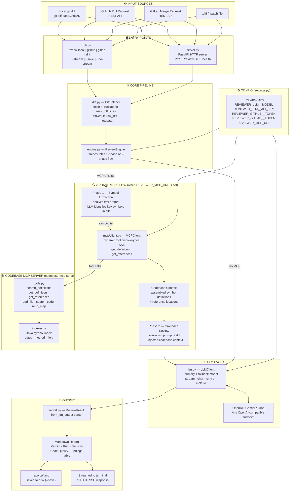

# ai-code-reviewer

LLM-powered code review from the terminal or via HTTP API. Reviews local git diffs, GitHub Pull Requests, and GitLab Merge Requests — outputs a structured markdown report covering security vulnerabilities, code quality issues, and a clear verdict.

Inspired by and adapted from [cortex-agent](../cortex-agent)'s MR review pipeline.

## Architecture



## How It Works

```
┌─────────────────────────────────────────────────────────────────────────┐
│                                                                         │
│  Input source (one of):                                                 │
│    git diff main...HEAD           ──┐                                   │
│    GitHub PR  (REST API)            │  DiffFetcher                      │
│    GitLab MR  (REST API)            │  (diff.py)                        │
│    .diff / .patch file         ─────┤                                   │
│                                     ▼                                   │
│                              DiffResult                                 │
│                         (unified diff + metadata)                       │
│                                     │                                   │
│                                     ▼                                   │
│                           ReviewEngine (engine.py)                      │
│                                     │                                   │
│                    ┌────────────────▼───────────────┐                  │
│                    │  Build system prompt             │                  │
│                    │  (review.xml — 4-phase workflow) │                  │
│                    │                                  │                  │
│                    │  Inject diff into user message   │                  │
│                    │                                  │                  │
│                    │  LLMClient.chat()                │                  │
│                    │  (async, failover, retry)        │                  │
│                    └────────────────┬───────────────┘                  │
│                                     │                                   │
│                                     ▼                                   │
│                            ReviewResult                                 │
│                    (verdict, risk, markdown report)                     │
│                                     │                                   │
│                         ┌───────────┴──────────┐                       │
│                         ▼                      ▼                        │
│                   Terminal (Rich)         reports/*.md                  │
│                   or API response         (optional save)               │
└─────────────────────────────────────────────────────────────────────────┘
```

## Quick Start

### 1. Install

```sh
python -m venv .venv
source .venv/bin/activate
pip install -e .
```

### 2. Get a free API key

**Recommended (free, no credit card):** Google Gemini via AI Studio
1. Go to [aistudio.google.com/apikey](https://aistudio.google.com/apikey)
2. Sign in with your Google account
3. Click **Create API key** — done

```sh
cp .env.example .env
# Paste your key — .env.example already has the Gemini endpoint pre-configured:
# REVIEWER_LLM__API_KEY=your-google-ai-studio-key
```

Other free options: **Groq** ([console.groq.com](https://console.groq.com)) or **Ollama** (local, no key). See `.env.example` for setup.

### 3. Review a local diff

```sh
# Review changes between your branch and main
cr review local --base main --head HEAD

# Review staged changes
cr review local --staged

# Save the report
cr review local --base main --save
```

### 4. Review a GitHub PR

```sh
# Set REVIEWER_GITHUB__TOKEN in .env first
cr review github --repo octocat/hello-world --pr 42

# Post the review back as a PR comment
cr review github --repo myorg/myrepo --pr 42 --post-comment
```

### 5. Review a GitLab MR

```sh
# Set REVIEWER_GITLAB__TOKEN in .env first
cr review gitlab --project mygroup/myrepo --mr 7
```

### 6. Review a diff file

```sh
cr review diff changes.patch
```

## CLI Reference

```
cr review local   [--base BRANCH] [--head BRANCH] [--path DIR] [--staged]
cr review github  --repo OWNER/REPO --pr NUMBER [--post-comment]
cr review gitlab  --project NAMESPACE/REPO --mr NUMBER
cr review diff    FILE

Common options (all review subcommands):
  --stream / --no-stream   Stream output as generated (default: --stream)
  --save / --no-save       Save report to output directory (default: --no-save)
  --output-dir DIR         Override output directory
```

**Exit codes:**
- `0` — APPROVE or DISCUSS
- `1` — REQUEST CHANGES (blocks CI)

## HTTP API

Start the server:

```sh
uvicorn src.server:app --reload --port 8090
# or
python src/server.py
```

API docs at [http://localhost:8090/docs](http://localhost:8090/docs).

### Review a GitHub PR

```sh
curl -X POST http://localhost:8090/review/github \
  -H "Content-Type: application/json" \
  -d '{"repo": "octocat/hello-world", "pr_number": 42}'
```

### Streaming review (SSE)

```sh
curl -N -X POST http://localhost:8090/review/github/stream \
  -H "Content-Type: application/json" \
  -d '{"repo": "octocat/hello-world", "pr_number": 42}'
```

### Review a raw diff

```sh
curl -X POST http://localhost:8090/review/diff \
  -H "Content-Type: application/json" \
  -d '{"diff": "--- a/foo.py\n+++ b/foo.py\n@@ -1 +1 @@\n-x = 1\n+x = 2"}'
```

## Review Report Format

Every review follows this structure (adapted from cortex-agent's `review.xml`):

```
## Code Review
> Verdict: APPROVE / REQUEST CHANGES / DISCUSS | Risk: LOW / MEDIUM / HIGH / CRITICAL | Findings: ...

### What Changed
### Risk Assessment         ← table: overall, security, complexity, blast radius
### Security Analysis       ← CRITICAL/HIGH: full breakdown; MEDIUM: compact; LOW: table
### Code Quality Analysis   ← same severity hierarchy
### Already Handled         ← false positives dismissed after analysis
### Open Questions          ← concerns that need more context
### Verdict                 ← final decision + blocking items
```

## LLM Configuration

Supports any OpenAI-compatible endpoint. Configure in `.env`:

```env
REVIEWER_LLM__MODEL=gpt-4o
REVIEWER_LLM__API_KEY=sk-...
REVIEWER_LLM__BASE_URL=https://api.openai.com/v1

# Optional failover (used on 429 / 5xx after retries)
REVIEWER_LLM__FALLBACK_MODEL=gpt-4o-mini
```

### Using other providers

```env
# OpenRouter (access 100+ models via one API)
REVIEWER_LLM__BASE_URL=https://openrouter.ai/api/v1
REVIEWER_LLM__MODEL=anthropic/claude-3.5-sonnet

# Anthropic direct (via OpenAI-compatible gateway)
REVIEWER_LLM__BASE_URL=https://api.anthropic.com/v1
REVIEWER_LLM__MODEL=claude-3-5-sonnet-20241022

# Local (vLLM / Ollama)
REVIEWER_LLM__BASE_URL=http://localhost:11434/v1
REVIEWER_LLM__MODEL=llama3.1
```

## Project Structure

```
ai-code-reviewer/
├── .github/
│   └── workflows/
│       └── ci.yml            lint → test → smoke → self-review
├── src/
│   ├── config/
│   │   └── settings.py       Pydantic settings (env-driven)
│   ├── reviewer/
│   │   ├── llm.py            Async LLM client — failover, retry, streaming
│   │   ├── diff.py           DiffFetcher — local git, GitHub API, GitLab API, file
│   │   ├── engine.py         ReviewEngine — orchestrates diff → LLM → result
│   │   ├── report.py         ReviewResult — parsing, save to disk, summary
│   │   └── prompts/
│   │       └── review.xml    4-phase review prompt (UNDERSTAND → PLAN → ANALYSE → REPORT)
│   └── server.py             FastAPI HTTP API + SSE streaming
├── cli.py                    Click CLI (cr review local/github/gitlab/diff)
├── reports/                  Generated review reports (git-ignored)
├── pyproject.toml
├── .env.example
└── README.md
```

## CI/CD

The GitHub Actions workflow runs four jobs on every push and PR:

| Job | When | What it does |
|-----|------|-------------|
| `lint` | always | ruff lint + format check + mypy |
| `test` | after lint | pytest unit tests |
| `smoke` | after lint | imports all modules, starts FastAPI app, runs CLI --help |
| `review-self` | push to main + API key set | Reviews the last commit's own diff, uploads report as artifact |

To enable the self-review job: add `REVIEWER_LLM__API_KEY` to GitHub → Settings → Secrets.
